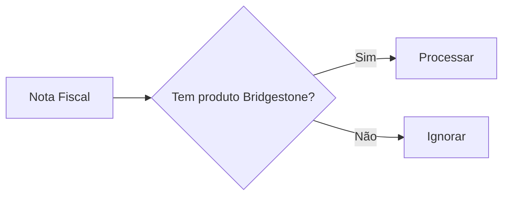

# Documentação Detalhada - CRUD.py

Este documento fornece uma análise técnica completa do arquivo `crud.py`, que é o **núcleo dos cálculos e filtros** da API Bridgestone. Este módulo é responsável por extrair, transformar e preparar os dados de faturamento para envio à API ScannTech.

## 📋 Índice

- [Visão Geral](#visão-geral)
- [Funções Principais](#funções-principais)
- [Filtros de Dados](#filtros-de-dados)
- [Cálculos Financeiros](#cálculos-financeiros)
- [Regras de Negócio](#regras-de-negócio)
- [Transformação de Dados](#transformação-de-dados)
- [Mapeamentos](#mapeamentos)
- [Fluxo de Processamento](#fluxo-de-processamento)
- [Exemplos Práticos](#exemplos-práticos)

## 🎯 Visão Geral

O arquivo `crud.py` é responsável por:
- **Extrair** dados do banco PostgreSQL (tabelas de faturamento)
- **Filtrar** apenas vendas válidas conforme critérios de negócio
- **Calcular** valores incluindo impostos e taxas específicas
- **Agrupar** produtos não-Bridgestone como "Outros"
- **Transformar** dados para o formato exigido pela API ScannTech
- **Gerar** relatórios em CSV/Excel para auditoria

## 🔧 Funções Principais

### 1. `get_faturamento()`

**Propósito**: Extrai faturamentos com paginação
**Uso**: Endpoints de consulta geral

```python
def get_faturamento(
    db: Session,
    skip: int = 0,
    limit: int = 100,
    agrupar_outros: bool = True,
    filtrar_canceladas: bool = True,
    filial: str = None,
):
```

**Parâmetros**:
- `skip`: Paginação - registros a pular
- `limit`: Máximo de registros retornados
- `agrupar_outros`: Agrupa produtos não-Bridgestone
- `filtrar_canceladas`: Remove notas canceladas
- `filial`: Filtro por centro/filial específica

### 2. `get_faturamento_per_date()`

**Propósito**: Extrai faturamentos por período específico
**Uso**: Envios para ScannTech e consultas por data

```python
def get_faturamento_per_date(
    db: Session,
    data_inicial: str,  # "dd/mm/yyyy"
    data_final: str,    # "dd/mm/yyyy"
    agrupar_outros: bool = True,
    filtrar_canceladas: bool = True,
    filial: str = None,
) -> List[schemas.ModelScannTech]:
```

**Diferenças**: Adiciona filtro de período usando `between()`

### 3. `aggregate_by_numero_nota()`

**Propósito**: **Função central** - Agrupa itens por nota fiscal e aplica todas as regras de negócio
**Complexidade**: Alta - Contém toda a lógica de transformação

## 🔍 Filtros de Dados

### Filtros SQL Aplicados

```python
faturamentos = (
    db.query(models.ItemFaturamento)
    .filter(
        # FILTROS OBRIGATÓRIOS
        models.ItemFaturamento.NUMERO_NOTA.isnot(None) &           # Deve ter número da nota
        models.ItemFaturamento.RESULTADO_FATURAMENTO.isnot(None) & # Deve ter resultado
        models.ItemFaturamento.COMISSAO_TIPO.like("VENDA") &       # Apenas vendas
        
        # FILTROS DE CFOP (Operações Fiscais)
        (
            models.ItemFaturamento.CFOP.not_like("5117AA") |       # Exclui devolução estadual
            models.ItemFaturamento.CFOP.not_like("6117AA")         # Exclui devolução interestadual
        ) &
        
        # FILTROS DE CENTRO/FILIAL
        models.ItemFaturamento.CENTRO.not_like("03%") &            # Exclui centros 03xx
        (models.ItemFaturamento.CENTRO.like(filial) if filial else True) &
        
        # FILTRO DE CANCELAMENTO
        (
            models.ItemFaturamento.CANCELADA.is_(None)             # Exclui canceladas
            if filtrar_canceladas
            else True
        )
    )
    .order_by(models.ItemFaturamento.DATA_CRIADA.desc())
)
```

### Centros/Filiais Incluídos

| Centro | Status | Descrição |
|--------|--------|-----------|
| 01xx   | ✅ Incluído | Filiais principais |
| 02xx   | ✅ Incluído | Filiais secundárias |
| 03xx   | ❌ Excluído | Centros específicos |
| 0105   | 💭 Comentado | Pode ser excluído futuramente |

### Tipos de Operação Filtrados

```python
# INCLUÍDOS
COMISSAO_TIPO = "VENDA"           # Apenas vendas normais

# EXCLUÍDOS
CFOP = "5117AA" ou "6117AA"       # Devoluções
# TIPO_ORDEM = "ZVSR"             # Comentado - vendas de serviço
```

## 💰 Cálculos Financeiros

### 1. Cálculo do Valor Unitário (importeUnitario)

```python
importeUnitario = round(
    item.VLR_UNITARIO +                                    # Valor base
    (
        (item.ICMS_ST / item.QUANTIDADE)                   # ICMS ST por unidade
        if (item.QUANTIDADE and item.ICMS_ST) 
        else 0
    ) +
    (
        (
            (item.ICMS_ST / item.QUANTIDADE) * 1.3 / 100   # Taxa 1.3% para importados
        )
        if item.GRUPO_MERC == "4153"                       # Apenas grupo 4153
        else 0
    ),
    2
)
```

**Componentes**:
1. **Valor Unitário Base**: `VLR_UNITARIO`
2. **ICMS ST por Unidade**: `ICMS_ST / QUANTIDADE`
3. **Taxa de Importação**: `1.3%` do ICMS ST (apenas grupo mercadoria 4153)

### 2. Cálculo do Valor Total do Item (importe)

```python
importe = (
    item.TOTAL_BRUTO +                                     # Valor bruto total
    (item.ICMS_ST or 0) +                                  # ICMS ST total
    (
        ((item.TOTAL_BRUTO + (item.ICMS_ST or 0)) * 1.3 / 100)  # Taxa 1.3%
        if item.GRUPO_MERC == "4153"
        else 0
    )
)
```

**Componentes**:
1. **Total Bruto**: Valor base do item
2. **ICMS ST**: Imposto sobre substituição tributária
3. **Taxa de Importação**: `1.3%` sobre (Total Bruto + ICMS ST) para produtos importados

### 3. Cálculo de Desconto

```python
descuento = round(abs(item.DESCONTO_ABSOLUTO), 2)
```

**Regra**: Sempre valor absoluto (positivo) do desconto

### 4. Valor Total da Nota Fiscal

```python
total_faturamento = sum(map(lambda x: x.importe, itens_modificados))
```

**Regra**: Soma de todos os `importe` dos itens (após aplicação de impostos e taxas)

## 📊 Regras de Negócio

### 1. Produtos Bridgestone Permitidos

```python
grupos_permitidos = [
    "PNEU 020 HP",     # High Performance
    "PNEU 030 UHP",    # Ultra High Performance
    "PNEU 040 STD",    # Standard
    "PNEU 060 LTR",    # Light Truck
    "PNEU 070 VAN",    # Van
    "PNEU 100 TBR M",  # Truck Bus Radial Medium
    "PNEU 120 TBR L",  # Truck Bus Radial Large
    "PNEU 130 AGS S",  # Agricultural Small
    "PNEU 150 AGS L",  # Agricultural Large
    "PNEU 160 AGR L",  # Agricultural Large (variant)
    "PNEU 170 OTR",    # Off The Road
    "PNEU 180 OTR",    # Off The Road (variant)
]
```

**Critério de Inclusão**: Nota fiscal deve ter **pelo menos um** produto dos grupos permitidos

### 2. Agrupamento "Outros"

```python
if item.GRUPO not in grupos_permitidos:
    if agrupar_outros:
        if item_agregado is None:
            item_agregado = deepcopy(itemDetalhes)
            item_agregado.descripcionArticulo = "Outros"
            item_agregado.codigoArticulo = "0"
            item_agregado.codigoBarras = None
            item_agregado.cantidad = 1
        else:
            # Soma valores dos produtos não-Bridgestone
            item_agregado.importeUnitario += itemDetalhes.importeUnitario
            item_agregado.importe += itemDetalhes.importe
            item_agregado.descuento += itemDetalhes.descuento
```

**Lógica**:
1. Se produto não é Bridgestone E flag `agrupar_outros` = True
2. Cria item único "Outros" com código "0"
3. Soma todos os valores de produtos não-Bridgestone
4. Quantidade sempre = 1 (representa o agrupamento)

### 3. Tratamento de Cancelamentos

```python
cancelada = True if items[0].CANCELADA else False
```

**Regra**: Status de cancelamento da primeira linha da nota (todas têm o mesmo status)

## 🔄 Transformação de Dados

### 1. Geração de ID Cliente

```python
def set_idCliente(v, values: clientes_schemas.Cliente) -> str:
    ddd = values.TELEFONE1[:2] if values.TELEFONE1 else "00"
    last_4_phone = values.TELEFONE1[-4:] if values.TELEFONE1 else "0000"
    first_5_cpf_cnpj = values.CPF_CNPJ[:5] if values.CPF_CNPJ else "00000"
    last_2_cpf_cnpj = values.CPF_CNPJ[-2:] if values.CPF_CNPJ else "00"
    return ddd + last_4_phone + first_5_cpf_cnpj + last_2_cpf_cnpj
```

**Formato**: `DD9999NNNNNNNN` (13 dígitos)
- `DD`: DDD do telefone
- `9999`: Últimos 4 dígitos do telefone
- `NNNNN`: Primeiros 5 dígitos do CPF/CNPJ
- `NN`: Últimos 2 dígitos do CPF/CNPJ

### 2. Formatação de Data/Hora

```python
hora_formatada = f"{items[0].HORA_CRIADA[:2]}:{items[0].HORA_CRIADA[2:4]}:{items[0].HORA_CRIADA[4:]}"
data_criacao = f"{items[0].DATA_CRIADA.strftime('%Y-%m-%d')}T{hora_formatada}.000-0300"
```

**Formato de Saída**: `YYYY-MM-DDTHH:MM:SS.000-0300` (ISO 8601 com timezone Brasil)

### 3. Código de Barras

```python
def get_barcode_by_codigoMaterial(db: Session, lista_codigo_material: List[str]):
    materiais = (
        db.query(models.MateriaisNovo)
        .filter(models.MateriaisNovo.COD_SAP.in_(lista_codigo_material))
        .all()
    )
    return {m.COD_SAP: m.BARCODE for m in materiais}
```

**Processo**:
1. Coleta todos códigos SAP da consulta
2. Remove zeros à esquerda: `str(f.CODIGO_MATERIAL).lstrip("0")`
3. Busca códigos de barras na tabela de materiais
4. Mapeia SAP → Código de Barras

## 🗺️ Mapeamentos

### 1. Formas de Pagamento → Códigos ScannTech

```python
condicoes_pagamento = {
    "K": 10,    # Cartão de Crédito
    "B": 9,     # Boleto
    "D": 9,     # Depósito
    "E": 13 if "CIELO DEBITO" in cond_descricao else 9,  # Débito/Outros
    "G": 11,    # PIX
    "L": 9,     # Financiamento
    "A": 0,     # À Vista
    "R": 9,     # Crediário
    "V": 0,     # À Vista (variant)
    "H": 12 if "TICKET" in cond_descricao else 9,       # Ticket/Outros
    "F": 9,     # Financeira
    "N": 11,    # Transferência
    "U": 9,     # Outros
    "C": 11,    # Cartão (genérico)
    "O": 9,     # Outros
    "S": 9,     # Cheque
}
```

**Códigos ScannTech**:
- `0`: À Vista/Dinheiro
- `9`: Crédito/Financiamento
- `10`: Cartão de Crédito
- `11`: PIX/Transferência
- `12`: Vale/Ticket
- `13`: Cartão de Débito

### 2. Grupos de Mercadoria Especiais

```python
if item.GRUPO_MERC == "4153":  # Produtos Importados
    # Aplica taxa adicional de 1.3%
```

**Grupo 4153**: Produtos importados que recebem taxa adicional de 1.3%

## 🔄 Fluxo de Processamento

### Etapa 1: Extração


### Etapa 2: Agrupamento


### Etapa 3: Validação


### Etapa 4: Transformação


### Etapa 5: Agrupamento "Outros"


### Etapa 6: Finalização


## 💡 Exemplos Práticos

### Exemplo 1: Nota com Produtos Bridgestone + Outros

**Entrada (Banco)**:
```
NUMERO_NOTA: 000123456
Items:
  - PNEU 040 STD (Bridgestone) - R$ 400,00
  - Óleo Motor (Outros) - R$ 50,00
  - Válvula (Outros) - R$ 10,00
```

**Saída (ScannTech)**:
```json
{
  "numero": "000123456",
  "total": 460.00,
  "detalles": [
    {
      "codigoArticulo": "123456",
      "descripcionArticulo": "PNEU 040 STD",
      "importe": 400.00,
      "cantidad": 4
    },
    {
      "codigoArticulo": "0",
      "descripcionArticulo": "Outros",
      "importe": 60.00,
      "cantidad": 1
    }
  ]
}
```

### Exemplo 2: Produto Importado (Grupo 4153)

**Cálculo Detalhado**:
```
Valor Base: R$ 1.000,00
ICMS ST: R$ 180,00
ICMS ST por unidade: R$ 180,00 / 4 = R$ 45,00
Taxa 1.3%: (R$ 1.000,00 + R$ 180,00) × 1.3% = R$ 15,34

Valor Final: R$ 1.000,00 + R$ 180,00 + R$ 15,34 = R$ 1.195,34
```

### Exemplo 3: Mapeamento de Pagamento

**Entrada**:
```
FORMA_PAGAMENTO: "E"
COND_DESCRICAO: "CIELO DEBITO"
```

**Processamento**:
```python
codigo = 13 if "CIELO DEBITO" in "CIELO DEBITO" else 9
# Resultado: 13 (Cartão de Débito)
```

## 🏗️ Estrutura de Saída

### ModelScannTech Completo

```python
responseScannTech = schemas.ModelScannTech(
    fecha=data_criacao,                    # "2025-08-07T14:30:00.000-0300"
    total=round(total_faturamento, 2),     # Soma dos itens
    numero=numero_nota,                    # "000123456"
    descuentoTotal=abs(desconto_total),    # Soma descontos
    recargoTotal=0,                        # Sempre 0
    cancelacion=cancelada,                 # True/False
    idCliente=clienteSchema.IDCLIENTE,     # ID gerado
    documentoCliente=None,                 # Sempre None
    codigoCanalVenta=1,                    # Sempre 1
    descripcionCanalVenta="VENDA NA LOJA", # Fixo
    detalles=itens_modificados,            # Lista de produtos
    pagos=[                                # Lista de pagamentos
        schemas.Pagos(
            importe=round(total_faturamento, 2),
            codigoTipoPago=codigo_pagamento,
            documentoCliente=None,
        )
    ],
)
```

## 🔧 Funções Auxiliares

### 1. `get_fechamento_per_date()`

**Propósito**: Gera resumo diário de vendas

```python
fechamento = schemas.Fechamento(
    fechaVentas=fechamento_data,           # Data das vendas
    montoVentaLiquida=round(total_vendas, 2),  # Total líquido
    montoCancelaciones=0.0,                # Sempre 0
    cantidadMovimientos=qtd_vendas,        # Quantidade de notas
    cantidadCancelaciones=qtd_cancelamentos, # Notas canceladas
)
```

### 2. `generate_csv_and_xlsx()`

**Propósito**: Gera relatórios para auditoria

**Estrutura**:
- Diretório: `data/YYYY-MM-DD/`
- Arquivos: `faturamentos_YYYY-MM-DD.csv` e `.xlsx`
- Conteúdo: Dados desnormalizados para análise

**Campos do Relatório**:
```python
{
    "data": faturamento.fecha,
    "total": faturamento.total,
    "numero_nf": faturamento.numero,
    "desconto_total": faturamento.descuentoTotal,
    "acrescimos_total": faturamento.recargoTotal,
    "cancelada": faturamento.cancelacion,
    "idCliente": faturamento.idCliente,
    "documentoCliente": faturamento.documentoCliente,
    "canal_venda": faturamento.codigoCanalVenta,
    "descricao_canal_venda": faturamento.descripcionCanalVenta,
    "forma_pagamento": pago.codigoTipoPago,
    "valor_pagamento": pago.importe,
    "codigoBarras": detalle.codigoBarras,
    "codigoSAP": detalle.codigoArticulo,
    "descricao_produto": detalle.descripcionArticulo,
    "quantidade": detalle.cantidad,
    "valorUnitario": detalle.importeUnitario,
    "desconto": detalle.descuento,
    "acrescimo_item": detalle.recargo,
}
```

## 🚀 Otimizações Futuras

### 1. Performance
```python
# Implementar paginação na agregação
# Usar joins em vez de queries separadas para clientes
# Cache para códigos de barras
```

### 2. Flexibilidade
```python
# Filtros configuráveis via parâmetros
# Grupos permitidos em configuração
# Mapeamentos de pagamento externalizados
```

### 3. Monitoring
```python
# Logs detalhados de cálculos
# Métricas de performance
# Validação de consistência
```

---

**Esta documentação cobre todos os aspectos críticos do arquivo `crud.py`. Para mudanças neste arquivo, sempre considere o impacto nos cálculos financeiros e na integração com a ScannTech.**
