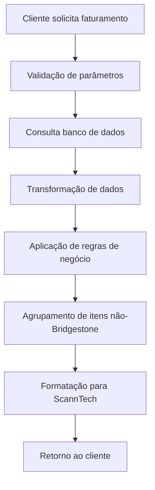
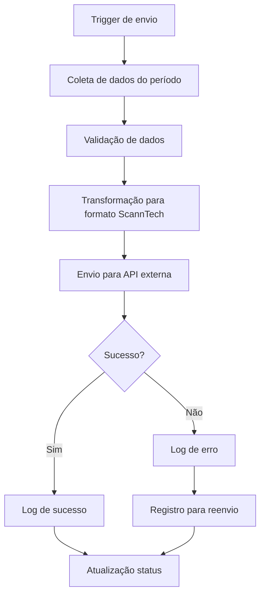
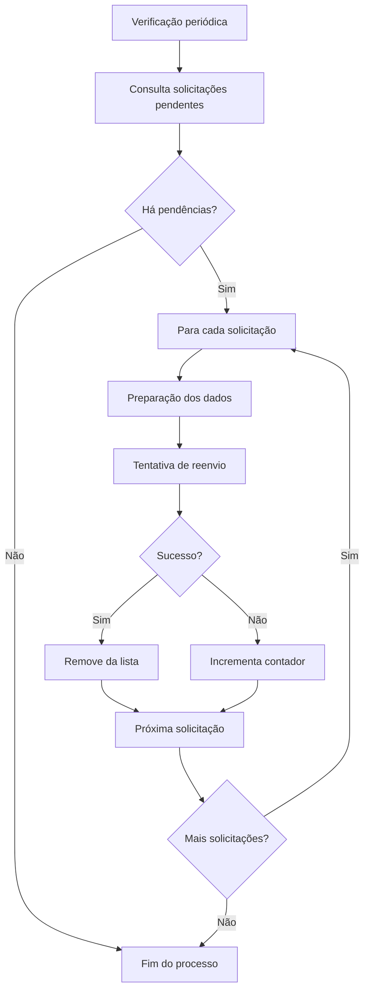

# Documentação Técnica - API Bridgestone

## 🏗️ Arquitetura da Aplicação

### Visão Geral da Arquitetura

```
┌─────────────────┐    ┌─────────────────┐    ┌─────────────────┐
│   FastAPI App   │    │   PostgreSQL    │    │  ScannTech API  │
│                 │◄──►│    Database     │    │                 │
│  - Endpoints    │    │                 │    │  - Faturamento  │
│  - Validação    │    │  - Faturamento  │    │  - Fechamento   │
│  - Logs         │    │  - Envios       │    │  - Cancelamento │
│  - SSL/HTTPS    │    │  - Histórico    │    │  - Devolução    │
└─────────────────┘    └─────────────────┘    └─────────────────┘
         │                       │                       │
         └───────────────────────┼───────────────────────┘
                                 │
                    ┌─────────────────┐
                    │  Telegram Bot   │
                    │  (Notificações) │
                    └─────────────────┘
```

### Componentes Principais

1. **FastAPI Application** (`main.py`)
   - Servidor web principal
   - Gerenciamento de rotas
   - Middleware de SSL
   - Dependency injection

2. **Database Layer** (`database.py`)
   - Configuração SQLAlchemy
   - Pool de conexões
   - Session management

3. **Business Logic** (`routers/`)
   - Lógica de negócio específica
   - Transformação de dados
   - Integração com APIs externas

4. **Configuration** (`configuracoes.py`)
   - Configurações centralizadas
   - Credenciais de API
   - Parâmetros de negócio

## 📊 Fluxo de Dados

### 1. Fluxo de Faturamento



### 2. Fluxo de Envio para ScannTech



### 3. Fluxo de Reenvio Automático



## 🗄️ Estrutura do Banco de Dados

### Principais Views/Tabelas Utilizadas

#### 1. Dados de Faturamento
- **Origem**: Views consolidadas do ERP
- **Campos principais**:
  - Identificação (DOC_FAT, NUMERO_NOTA, OV)
  - Cliente (CLIENTE_ID, CLIENTE_NOME)
  - Produto (CODIGO_MATERIAL, DESC_MATERIAL)
  - Valores (VLR_UNITARIO, QUANTIDADE, TOTAL)
  - Datas (DATA_CRIADA, DATA_CRIADA_OV)
  - Centro (CENTRO - código da filial)

#### 2. Controle de Envios
- **Propósito**: Rastreamento de envios para ScannTech
- **Campos**:
  - `id`: Identificador único
  - `enviado`: Status do envio
  - `conteudo`: Dados enviados
  - `id_lote`: Identificador do lote
  - `data_envio`: Data/hora do envio
  - `lista_notas`: Notas incluídas no envio

## 🔄 Transformação de Dados

### Mapeamento de Campos

#### Faturamento Interno → ScannTech

| Campo Interno | Campo ScannTech | Transformação |
|---------------|-----------------|---------------|
| DATA_CRIADA | fecha | Formato: dd/mm/yyyy |
| NUMERO_NOTA | numero | String direta |
| CLIENTE_ID | idCliente | String direta |
| TOTAL | total | Float |
| CODIGO_MATERIAL | codigoArticulo | String |
| DESC_MATERIAL | descripcionArticulo | String |
| VLR_UNITARIO | importeUnitario | Float |
| QUANTIDADE | cantidad | Float |
| MEIO_PAGTO | codigoTipoPago | Mapeamento específico |

### Regras de Negócio

#### 1. Agrupamento de Produtos Não-Bridgestone
```python
if agrupar_outros_flag and not is_bridgestone_product(codigo):
    # Agrupa todos os produtos não-Bridgestone em um item "Outros"
    codigo_produto = "OUTROS"
    descricao = "Outros produtos"
    # Soma valores e quantidades
```

#### 2. Tratamento de Cancelamentos
```python
if status_cancelado:
    cancelacao = True
    total = 0.0  # Zera valores para cancelamentos
```

#### 3. Mapeamento de Formas de Pagamento
```python
tipo_pagamento_map = {
    "DINHEIRO": 1,
    "CARTAO_CREDITO": 2,
    "CARTAO_DEBITO": 3,
    "PIX": 4,
    # ... outros mapeamentos
}
```

## 🔐 Segurança

### 1. SSL/TLS
- Certificados próprios em `app/cert/`
- Protocolo TLS 1.2+
- Criptografia de dados em trânsito

### 2. Autenticação (Desabilitada)
```python
# Código comentado no main.py
# app.include_router(login.router)
```
**Nota**: A autenticação está desabilitada na versão atual

### 3. Validação de Dados
- Schemas Pydantic para validação
- Sanitização de entradas
- Validação de tipos e formatos

### 4. Configurações Sensíveis
- Variáveis de ambiente para credenciais
- Arquivo `.env` não versionado
- Headers de autenticação Base64

## 📝 Schemas e Modelos

### Principais Schemas Pydantic

#### 1. ModelScannTech
```python
class ModelScannTech(BaseModel):
    fecha: str                    # Data da venda
    numero: str                   # Número da nota
    idCliente: str               # ID do cliente
    total: float                 # Total da venda
    cancelacion: bool           # Flag de cancelamento
    detalles: List[Detalles]    # Itens da venda
    pagos: List[Pagos]          # Formas de pagamento
```

#### 2. Fechamento
```python
class Fechamento(BaseModel):
    fechaVentas: date           # Data do fechamento
    montoVentaLiquida: float    # Valor líquido de vendas
    cantidadMovimientos: int    # Quantidade de movimentos
    montoCancelaciones: float   # Valor de cancelamentos
    cantidadCancelaciones: int  # Quantidade de cancelamentos
```

#### 3. Solicitacoes
```python
class Solicitacoes(BaseModel):
    fecha: date                 # Data da solicitação
    codigoCaja: Optional[int]   # Código da caixa
    tipo: str                   # Tipo: 'movimientos' ou 'cierresDiarios'
```

## 🛠️ Utilitários e Funções Auxiliares

### 1. Conversão Base64 (configuracoes.py)
```python
def converte_base64(usuario, senha):
    """Converte credenciais para autenticação Basic"""
    credentials = f"{usuario}:{senha}".encode("ascii")
    encoded_credentials = base64.b64encode(credentials).decode("ascii")
    return f"Basic {encoded_credentials}"
```

### 2. Limpeza de Arquivos Antigos
```python
def limpar_arquivos_antigos(diretorio, dias):
    """Remove arquivos mais antigos que X dias"""
    agora = time.time()
    periodo = dias * 86400
    # ... lógica de remoção
```

### 3. Setup de Logger
```python
def setup_logger():
    """Configura logging com rotação diária"""
    handler = TimedRotatingFileHandler(
        filename='logs/app.log',
        when='midnight',
        interval=1,
        backupCount=30
    )
```

## 🕐 Tarefas Agendadas

### Configuração de Horários (N8N)

**Nota**: As tarefas agendadas foram migradas do código Python para o N8N.

#### Fluxos Configurados no N8N:
- **Envio de Faturamento**: Trigger via HTTP request às 21:00
- **Verificação de Reenvios**: Trigger via HTTP request às 21:05  
- **Processamento de Cancelamentos**: Trigger via HTTP request às 21:10
- **Processamento de Devoluções**: Trigger via HTTP request às 21:15

#### Endpoints para N8N:
```python
# Endpoints disponíveis para triggers externos
GET /enviar/faturamento        # Envio principal de faturamento
GET /enviar/fechamento       # Envio de fechamento diário
GET /verificar/reenvios      # Verificação e reenvio de pendências
GET /verificar/cancelamentos # Processamento de cancelamentos
GET /verificar/devolucoes    # Processamento de devoluções
```

#### Configuração Original (Desabilitada):
```python
# Código comentado em main.py
# hora_envio_faturamento = "21:00"
# hora_verificacao_reenvio = "21:05" 
# hora_verificacao_cancelamentos = "21:10"
# hora_verificacao_devolucoes = "21:15"
```

### Implementação (Comentada)
```python
# Em main.py - atualmente desabilitado
# def iniciar_agendamento_thread():
#     iniciar_agendamento()
# 
# app.add_event_handler(
#     "startup", 
#     lambda: threading.Thread(target=iniciar_agendamento_thread).start()
# )
```

## 🔍 Monitoramento e Debugging

### 1. Logs Estruturados
```python
logger.info(f"Faturamento enviado: {response_data}")
logger.error(f"Erro ao enviar: {error_details}")
logger.debug(f"Dados processados: {processed_data}")
```

### 2. Tratamento de Erros
```python
try:
    resultado = operacao_complexa()
except Exception as e:
    logger.error(f"Erro em operacao_complexa: {e}")
    raise HTTPException(status_code=500, detail=str(e))
```

### 3. Validação de Responses
```python
if not response.ok:
    logger.error(f"API ScannTech retornou erro: {response.status_code}")
    # Registra para reenvio posterior
```

## 🔧 Configurações de Performance

### 1. Pool de Conexões
```python
engine = create_engine(
    SQLALCHEMY_DATABASE_URL,
    connect_args={"options": f"-c search_path=dbo,{schema}"}
)
```

### 2. Session Management
```python
def get_db():
    db = SessionLocal()
    try:
        yield db
    finally:
        db.close()  # Sempre fecha a sessão
```

### 3. Paginação
```python
def get_faturamento(db: Session, skip: int = 0, limit: int = 100):
    return db.query(Model).offset(skip).limit(limit).all()
```

**Nota**: Esta documentação técnica complementa o README.md principal e deve ser atualizada sempre que houver mudanças significativas na arquitetura ou fluxos de dados.
